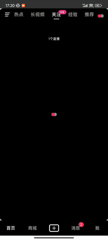

<h1 align="center">
  Douyin-Vue
</h1>

`douyin-vue` 是一个模仿 `抖音|TikTok` 的移动端短视频项目。`Vue` 在移动端的"最佳实践"，媲美原生 `App` 丝滑流畅的使用体验。使用了最新的 `Vue` 技术栈，基于 [`Vue3`](https://cn.vuejs.org/)、[`Vite5`](https://cn.vitejs.dev/)
、[`Pinia`](https://pinia.vuejs.org/)实现。数据保存在项目本地，通过 [`axios-mock-adapter`](https://github.com/ctimmerm/axios-mock-adapter) 库拦截Api 并返回本地json数据，模拟真实后端请求

